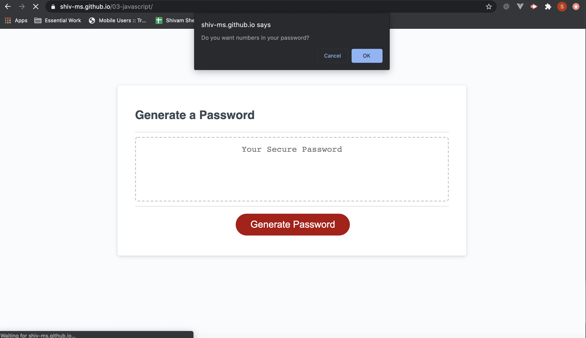

# Code Quiz
## The Repository
This repository ("`04-javascript`") is where my Code Quiz app resides [Code Quiz](https://shiv-ms.github.io/04-web-apis/)  The quiz requires the user to answer a series of prompts to gather the password criteria.  When all prompts are answered then a password is generated that matches the selected criteria
### The Password Generator will require the following information and validation before creating a password:
* Choose a length of at least 8 characters and no more than 128 characters
* Choose lowercase, uppercase, numeric, and/or special characters
* Input should be validated and at least one character type should be selected
* Once all promts are answered a password is generated and is then written to the page
## Password Generator
#### Desktop Image of Homepage

  

